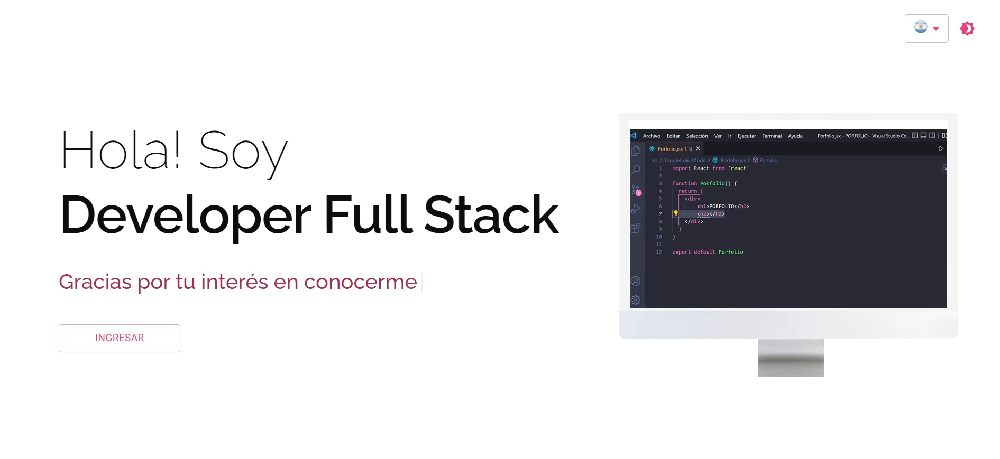
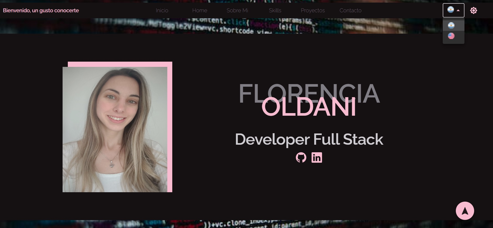
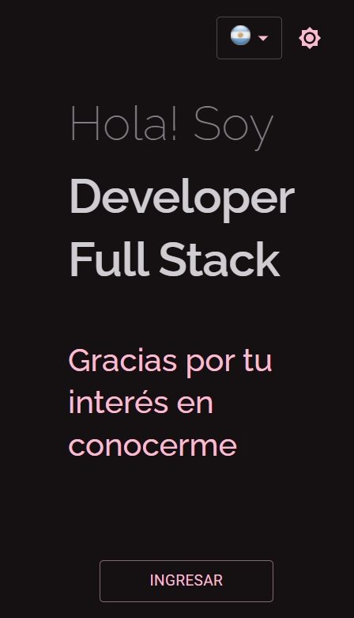
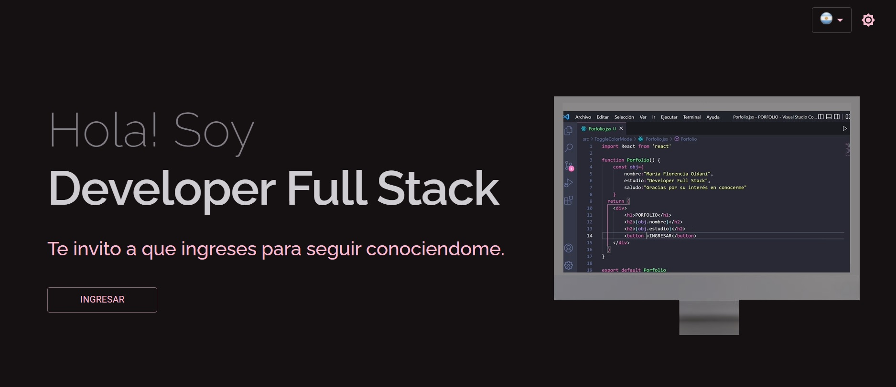
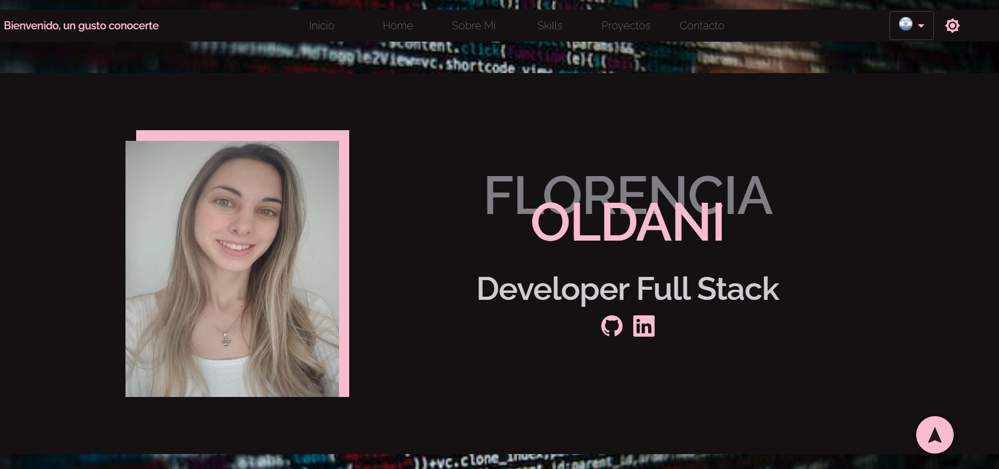
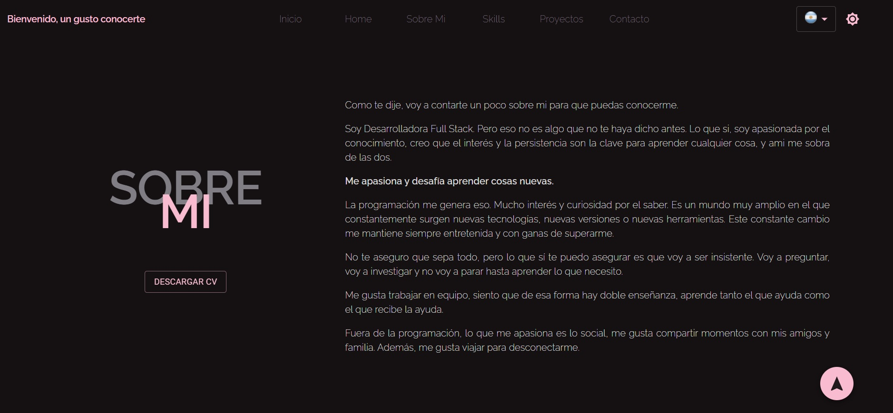
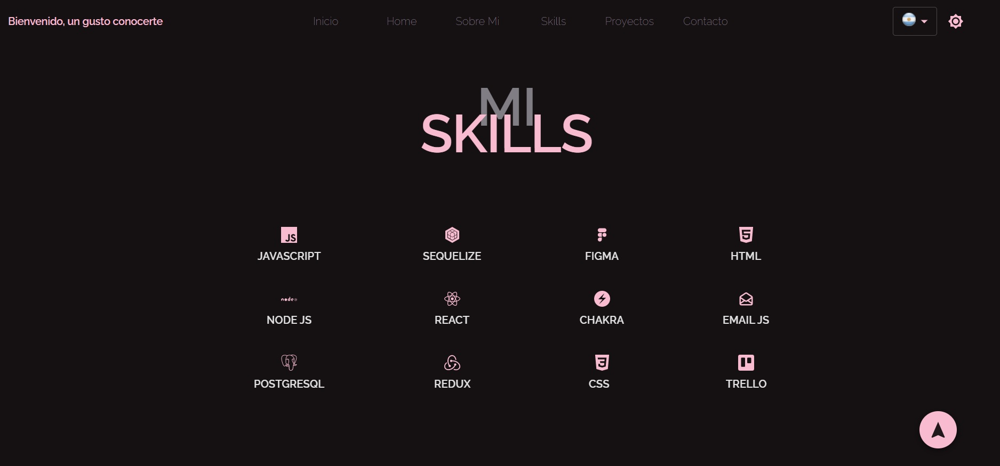
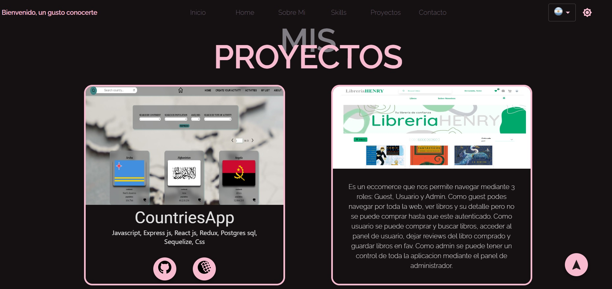
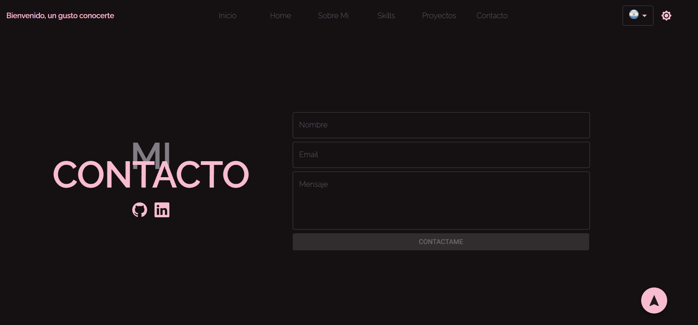

 
 <br />

#

# MI PORFOLIO

## Tecnologías utilizadas:

* __Javascript__
* __ReactJS__
* __i18next-language__
* __Hooks__
* __Material UI__
* __Email.Js__


## Antes de empezar
Es necesario tener, al menos, la última versión estable de Node y NPM. Asegurese de tenerlas para instalar correctamente las dependencias necesarias para correr el proyecto.

Las versiones requeridas son:
- **Node**: 14.20 o superior
- **NPM**: 6.14 o superior

Para chequear que versiones tiene instaladas:
> node -v
>
> npm -v

## Instrucciones para correr el servidor de desarrollo

1. Clonar el repositorio
2. Correr los siguientes comandos:
```
npm install
npm start
```

## Descripción
Porfolio Web 


## Funcionalidades:

**Funcionalidades extras:**
- Claro/Oscuro
- Idioma Español/Ingles
- Pagina Web totalmente responsive para Iphone 12 Pro (390 x 844)

 
  
 


## Deployment

La aplicación esta depolyada en [VERCEL](https://vercel.com/)

[Link](https://porfolio-fullstack-flor-oldani.vercel.app/) para visitar la app.


<br />
<br />

 
 
 
 
 
 

